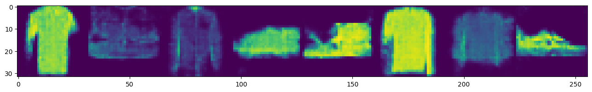
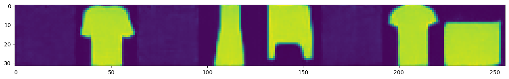
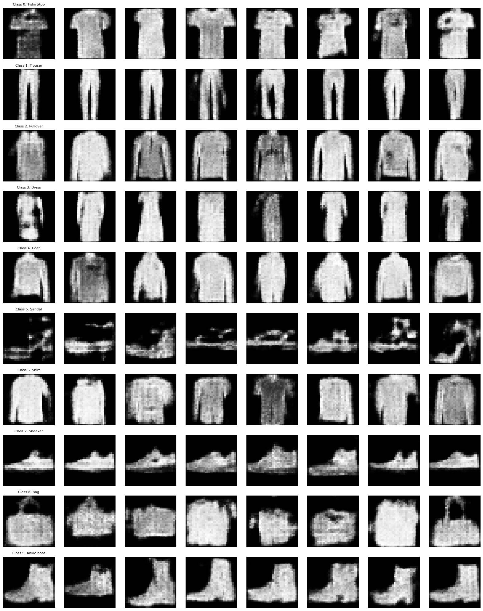
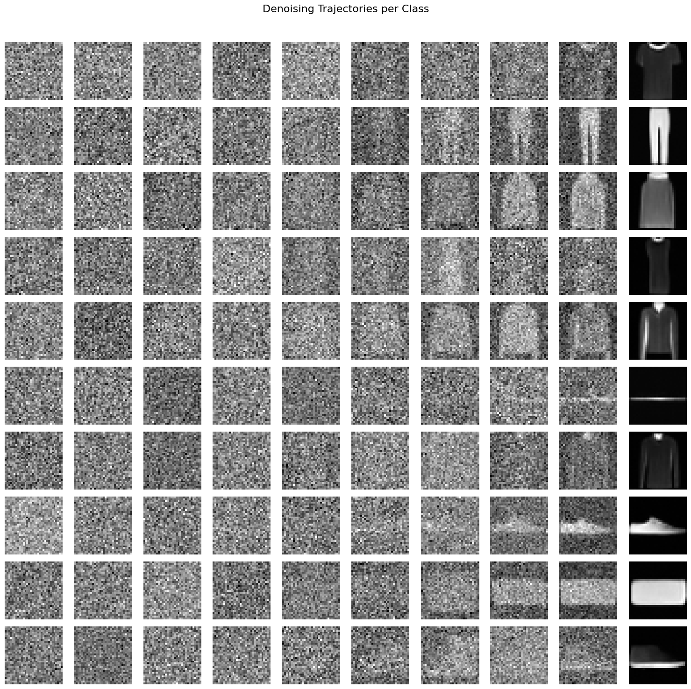
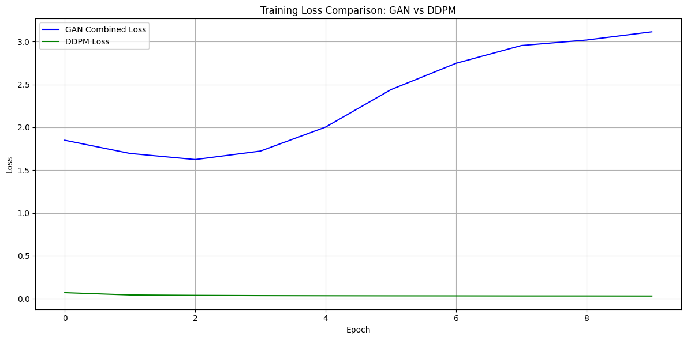

# Diffusion vs. GANs

This repository compares **Denoising Diffusion Probabilistic Models (DDPMs)** and **Generative Adversarial Networks (GANs)** on the FashionMNIST dataset. Both methods aim to generate realistic images from noise, but they do so in fundamentally different ways.


## 1. Mathematical Overview

### 1.1 GAN Objective

A standard GAN involves two players: a **Generator** $G$ and a **Discriminator** $D$. The goal is to solve:

$\min_{G}$ $\max_{D}$ \mathbb{E}_{\mathbf{x}\simp_{\text{data}}(\mathbf{x})}[\logD(\mathbf{x})]+\mathbb{E}_{\mathbf{z}\simp(\mathbf{z})}[\log(1-D(G(\mathbf{z})))].$


- $\mathbf{x}$ is a real image from the dataset.
- $\mathbf{z}$ is random noise.
- $G(\mathbf{z})$ is the generated (fake) image.
- $D(\mathbf{x})$ outputs the probability that $\mathbf{x}$ is real.

### 1.2 DDPM Objective

A DDPM gradually **diffuses** data by adding noise step-by-step and then **denoises** in reverse. Training is done by matching predicted noise $\epsilon_\theta(\mathbf{x}_t, t)$ to the actual noise $\epsilon$ at each step $t$:

$$
\mathcal{L}(\theta) = \mathbb{E}_{t, \mathbf{x}_0, \epsilon}\Big[
\|\epsilon - \epsilon_\theta(\sqrt{\bar{\alpha}_t}\,\mathbf{x}_0 + \sqrt{1-\bar{\alpha}_t}\,\epsilon,\, t)\|^2
\Big].
$$

During sampling, we iteratively remove noise from an initial Gaussian sample $ \mathbf{x}_T \sim \mathcal{N}(\mathbf{0}, \mathbf{I}) $ to recover $ \mathbf{x}_0 $.

## 2. Implemented Models

1. **GAN**  
2. **Conditional GAN (cGAN)**
3. **DDPM**  
4. **Conditional DDPM**

All models use **FashionMNIST** as the training dataset, resized to $32 \times 32$ and normalized to $[-1,1]$.


## 3. Results

### 3.1 Sample Images

#### GAN Samples

#### DDPM Samples

#### Conditional GAN

#### Conditional DDPM Samples


### 3.2 Loss Curves





## 4. Key Takeaways

1. **Stability vs. Detail**  
   - GAN training is adversarial and can be unstable but sometimes produces sharper details.
   - DDPM training is more stable and consistently generates coherent images.

2. **Mode Collapse**  
   - GANs can suffer from mode collapse, repeatedly generating similar outputs.
   - DDPMs do not typically exhibit mode collapse.

3. **Conditioning**  
   - Both models can be conditioned on class labels to generate class-specific images (cGAN, Conditional DDPM).


## 5. How to Use

### 5.1 Clone the Repository

Clone the repository to your local machine using Git:

```bash
git clone https://github.com/YourUsername/Diffusion_vs_GANs.git
cd Diffusion_vs_GANs
```

### 5.2 Install Dependencies

Install the required libraries by running:

```bash
pip install -r requirements.txt
```

This will install PyTorch, torchvision, NumPy, tqdm, matplotlib, einops, and any other libraries listed in the file.

### 5.3 Project Structure

The repository is organized as follows:

```
Diffusion_vs_GANs/
├── data/
│   └── load_data.py         # Data loading and preprocessing functions.
├── models/
│   ├── gan.py               # GAN model implementation.
│   ├── cgan.py              # Conditional GAN model implementation.
│   ├── ddpm.py              # DDPM model implementation.
│   └── cddpm.py             # Conditional DDPM model implementation.
├── scripts/
│   ├── train_gan.py         # Training script for GAN.
│   ├── train_cgan.py        # Training script for Conditional GAN.
│   ├── train_ddpm.py        # Training script for DDPM.
│   └── train_cddpm.py       # Training script for Conditional DDPM.
├── utils/
│   └── visualization.py     # Utility functions for plotting images and loss curves.
├── notebooks/
│   └── Diffusion_vs_GANs.ipynb  # Jupyter Notebook for experimentation.
├── results/                 # Directory to store generated samples, logs, and plots.
├── requirements.txt         # List of dependencies.
└── README.md                # This file.
```

### 5.4 Running the Code

It’s important to run the training scripts from the project root using the module flag `(-m)`. This ensures that Python sets up the correct module paths. Here’s how to run each training script:

- **Train the GAN:**

  ```bash
  python -m scripts.train_gan --epochs 10 --batch_size 64 --img_size 32
  ```

- **Train the Conditional GAN (cGAN):**

  ```bash
  python -m scripts.train_cgan --epochs 10 --batch_size 128 --img_size 32 --class_label 0
  ```

- **Train the DDPM:**

  ```bash
  python -m scripts.train_ddpm --epochs 10 --batch_size 8 --img_size 32
  ```

- **Train the Conditional DDPM:**

  ```bash
  python -m scripts.train_cddpm --epochs 10 --batch_size 8 --img_size 32 --class_label 0
  ```

### 5.5 Viewing Results

- **Generated Images:**  
  After training, generated sample images are saved in the **results/** folder. For example, GAN samples are saved as `results/gan_samples.png`.

- **Loss Curves and Logs:**  
  Training logs and loss curves (if implemented) will also be saved in the **results/** folder. You can open these images to inspect the training progress.

- **Interactive Experimentation:**  
  You can also use the provided Jupyter Notebook in the **notebooks/** folder for interactive experimentation and visualization:
  
  ```bash
  jupyter notebook notebooks/Diffusion_vs_GANs.ipynb
  ```

This notebook is ideal for testing different configurations, visualizing intermediate results, and comparing the performance of the models.
